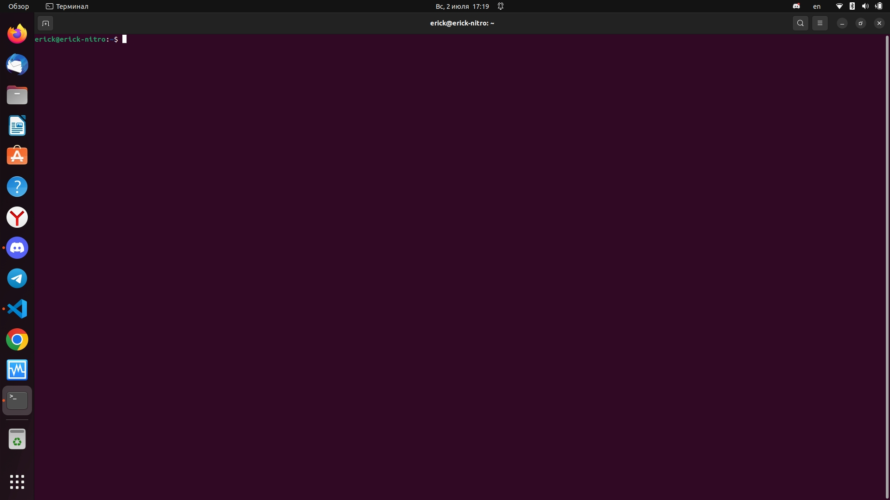
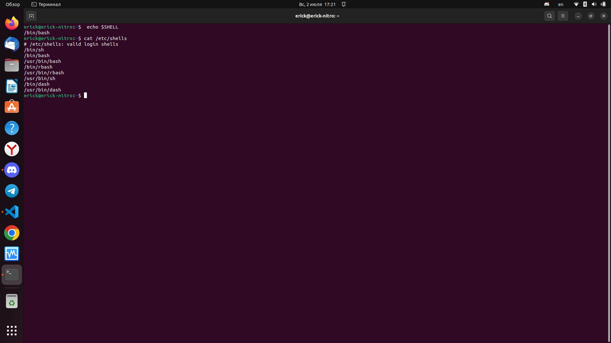

# Домашнее задание к занятию "Знакомство с операционной системой Linux"

### Задание 1

1. Подговьте рабочее пространство:

- Скачайте с сайта [VirtualBox](https://www.virtualbox.org/) и установите на свой компьютер
- Создайте новую виртуальную машину
- Скачайте [Ubuntu](https://ubuntu.com/download/desktop)
- Установите Ubuntu на вашу виртуальную машину

**Примечание:** Если у вас операцинная система macOS или Linux, воспользуйтесь [инструкцией](macOs-instr.md).

*Сделайте скриншот консоли, где в строке ввода будет ваше ФИО.*

Ответ:



### Задание 2

Запустите терминал и выполните команды:

- echo $SHELL
- cat /etc/shells

*Ответ приведите в виде снимка экрана и прокомментируйте в свободной форме результаты выполнения указанных команд*

Ответ:

первая команда показывает какая оболочка будет выполняться при входе в систему через login
вторая команда показывает какие оболочки есть в моей операционной системе

### Задание 3

Установите при помощи утилиты **apt** файловый менеджер **mc**. 

*Решение приведите в виде последовательности команд или снимка экрана*
Ответ: 

```bash
sudo apt install mc
mc
```

### Задание 4* (необязательно выполнение)
Его выполнение необязательное и не влияет на получение зачёта по домашнему заданию. Можете его решить, если хотите лучше разобраться в материале.

Выполните следующие команды:

1. id
2. sudo id

*Объясните, почему вывод одной и той же команды отличается в этих случаях.*

Ответ: 
1. Команда показывает информацию пользователя, под которым сейчас работают в терминале
2. Информация пользователя root
------