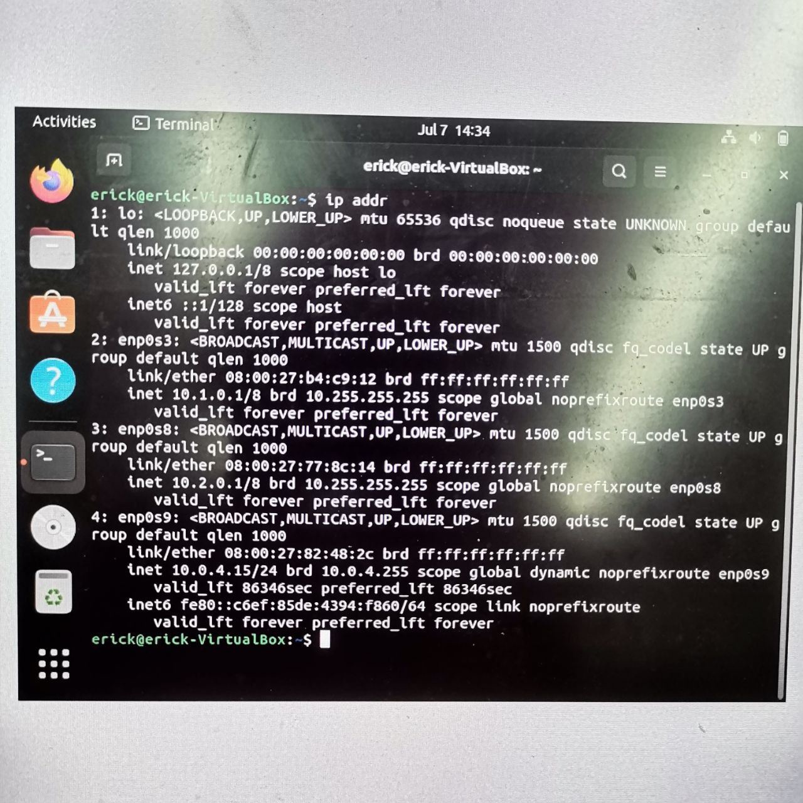

# Основы работы в терминале ОС Linux

### Задание 1. Процессы

1. Запустите текстовый редактор nano
2. Откройте ещё одно окно терминала
3. С помощью команды `ps` определите PID запущенного процесса
4. Выполните команду `kill PID`

Что произошло в терминале с nano?

*Ответ приведите в виде последовательности команд и снимка экрана*

Ответ:

таким образом мы остановили процесс запущенный утилитой nano

### Задание 2. Утилита htop

1. Установите утилиту htop
2. С помощью htop ответьте на вопросы:
   - Какие процессы занимают больше всего памяти?
   - Какие процессы занимают больше всего процессорного времени?

*Приведите ответ в виде снимков экрана*

Ответ:

из скриншота видно, что процесс телеграмма занимает больше всего памяти, а больше всего занимает процессорного времени  systemd-библиотека

### Задание 3. Работа с сетью

1. Добавьте в виртуальную машину два дополнительных сетевых адаптера с внутренней (internal) сетью
2. Настройте на первом из них адрес 10.1.0.1 маску подсети 255.0.0.0
3. Настройте на втором из них адрес 10.2.0.1 маску подсети 255.0.0.0
4. На обоих интерфейсах настройте адрес dns-сервера как 8.8.8.8 и шлюз по умолчанию 10.1.1.1
5. Выполните команду ip addr

*Приведите ответ в виде снимка экрана с выполненной командой ip addr*
