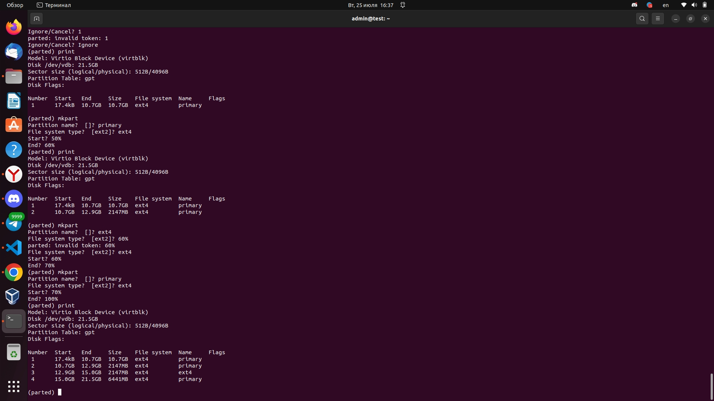
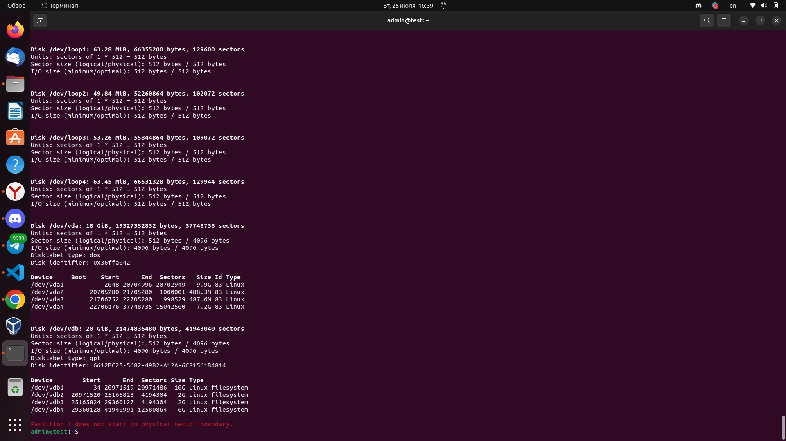
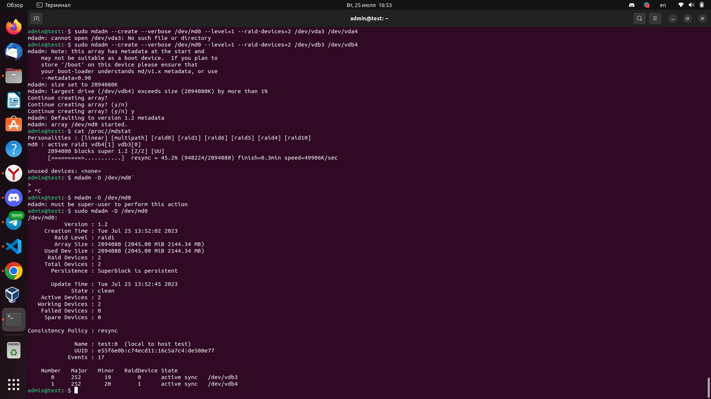
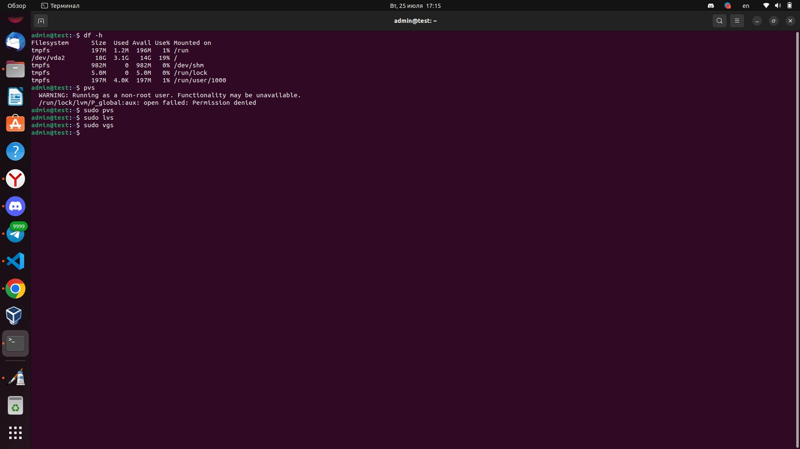

# Дисковые системы


### Задача №1

Какие виды RAID увеличивают производительность дисковой системы?

Ответ:

Несколько уровней RAID увеличивают производительность дисковой системы. Вот некоторые из них:

1. RAID 0: RAID 0 использует технику стрипирования данных, в которой данные разделяются и записываются на несколько дисков. Это увеличивает пропускную способность чтения и записи данных, поскольку каждый диск может выполнять операции одновременно. Однако, RAID 0 не обеспечивает отказоустойчивость, так как отказ одного диска приводит к потере всех данных.
2. RAID 10 (RAID 1+0): RAID 10 сочетает преимущества RAID 0 и RAID 1. Диски объединяются попарно и затем данные стрипируются по объединенным дискам. Такое объединение дисков обеспечивает высокую производительность чтения и записи данных, а отказ одного диска не приводит к потере данных.
3. RAID 5: RAID 5 использует технику распределения четности, где данные и информация о четности записываются на различные диски в массиве. Это позволяет объединенным дискам выполнять операции одновременно и обеспечивает высокую производительность. RAID 5 также обеспечивает отказоустойчивость, так как данные могут быть восстановлены при отказе одного диска.
4. RAID 6: RAID 6 также использует технику распределения четности, но в отличие от RAID 5, сохраняются две информации о четности. Это обеспечивает повышенную отказоустойчивость, так как данные могут быть восстановлены при одновременном отказе двух дисков. RAID 6 также обеспечивает высокую производительность при чтении данных.


### Задача №2

Назовите преимущества использования VFS. Используется ли VFS при работе с tmpfs? Почему?

Ответ:

VFS (Virtual File System) - это абстрактный слой в операционной системе, который предоставляет единый интерфейс для работы с различными файловыми системами. Он позволяет пользовательским программам обращаться к файлам и директориям независимо от того, какая файловая система используется.
Преимущества использования VFS включают:
1. Единый интерфейс: VFS предоставляет стандартный интерфейс для работы с файлами и директориями, что упрощает разработку и портирование программ, не зависящих от конкретной файловой системы.
2. Поддержка различных файловых систем: VFS позволяет использовать различные файловые системы на одной системе, например, ext4, NTFS, FAT и другие. Это позволяет работать с файлами, хранящимися на разных устройствах и поддерживает интероперабельность между различными ОС.
3. Транспарентное перемещение файлов между файловыми системами: благодаря VFS, можно перемещать файлы между разными файловыми системами без изменения пользовательского кода.

Относительно tmpfs - это файловая система в операционной системе Linux, которая загружается в оперативную память и хранит данные в виде файлов. tmpfs использует VFS для предоставления файловой системы в ядре Linux.
Поэтому можно сказать, что при работе с tmpfs также используется VFS. VFS позволяет управлять операциями чтения, записи и директориями в tmpfs, делая его доступным для пользовательского кода и ядра операционной системы.


### Задача №3

Подключите к виртуальной машине 2 новых диска. 

1. На первом диске создайте таблицу разделов MBR, создайте 4 раздела: первый раздел на 50% диска, остальные диски любого размера на ваше усмотрение. Хотя бы один из разделов должен быть логическим.

Инструкция:

1. Вводим команду 
```bash
sudo fdisk --list
```
2. Выбираем из имеющихся диск в данном случае /dev/vdb и делим его на разделы MBR

```bash
sudo fdisk /dev/vdb
```
3. Потом выбираем "o" для таблицы разделов MBR
4. n для создание нового раздела
5. p (Primary partion)
6. первоначальный раздел
7. конечный раздел и так делим на 4 раздела, 1 раздел 50%.


2. На втором диске создайте таблицу разделов GPT. Создайте 4 раздела: первый раздел на 50% диска, остальные любого размера на ваше усмотрение.

1. Вводим команду 
```bash
sudo fdisk --list
```
2. Выбираем из имеющихся диск в данном случае /dev/vdb и делим его на разделы MBR

```bash
sudo parted /dev/vdb
```
3. mklabel gpt
4. mkpart
5. primary
6. тип файловой системы ext4
7. начальный раздел-пример 0%
8. конечный раздел 50% и так делим на 4 раздела




В итоге получается 



### Задача №4

Создайте программный RAID 1 в вашей ОС, используя программу `mdadm`.

Объем RAID неважен.

Инструкция 

1. Воспользуемся утилитой mdadm
2. Вводим команду 

```bash
sudo mdadm --create --verbose /dev/md0 --level=1 --raid-devices=2 /dev/vdb3 /dev/vdb4 
```

Где /dev/md0-название raid массива
--level=1- уровень raid 
--raid-devices=2- количество дисков

3. Проверяем 

```bash
sudo mdadm -D /dev/md0
```



### Задача №5

Влияет ли количество операций ввода-вывода на параметр `load average`?

Да, количество операций ввода-вывода (I/O) может оказывать влияние на параметр "load average" в Linux. Параметр "load average" представляет собой среднее количество процессов, находящихся в состоянии ожидания (в том числе I/O операций) в течение определенного периода времени. Изменения в количестве I/O операций могут повлиять на загрузку системы и, следовательно, на значения "load average".

Когда система испытывает высокую нагрузку I/O операций, процессы, ожидающие завершения этих операций, могут увеличиться, что приведет к увеличению значений "load average". Если система не может обработать все I/O операции сразу, процессы могут быть вынуждены ждать, пока данные будут получены или записаны на диске. Это может вызвать временное увеличение значения "load average".

Однако, следует учитывать, что "load average" отражает не только I/O операции, но и другие факторы, такие как загрузка ЦП и контекстные переключения процессов. Таким образом, влияние I/O операций на "load average" может зависеть от конкретной конфигурации системы и ее нагрузке в целом.

### Задача №6

1. Сделайте скриншоты вывода комманд df -h, pvs, lvs, vgs.



2. Подключите к ОС 2 новых диска.
3. Создайте новую VG, добавьте в него 1 диск.
4. Создайте 2 LV, распределите доступное пространство между ними поровну.
5. Создайте на обоих томах файловую систему `xfs`.
6. Создайте две точки монтирования и смонтируйте каждый из томов.
7. Сделайте скриншот вывода комманд df -h.
8. Добавьте в VG второй оставшийся диск.
9. Расширьте первый LV на объем нового диска.   
10. Расширьте файловую систему на размер нового доступного пространства.    
11. Сделайте скриншоты вывода комманд df -h, pvs, lvs, vgs.
