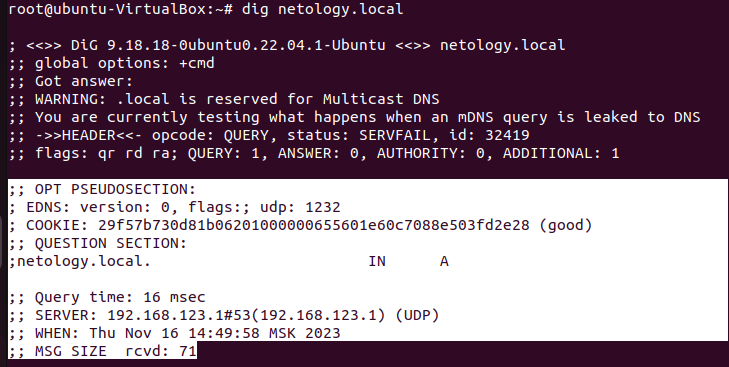
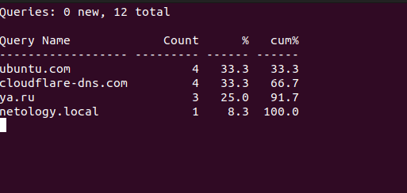
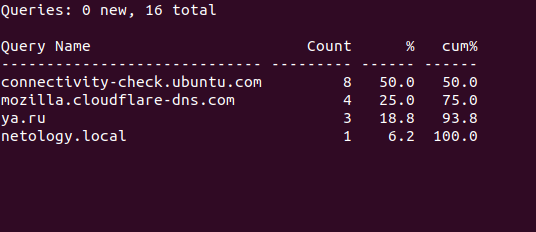
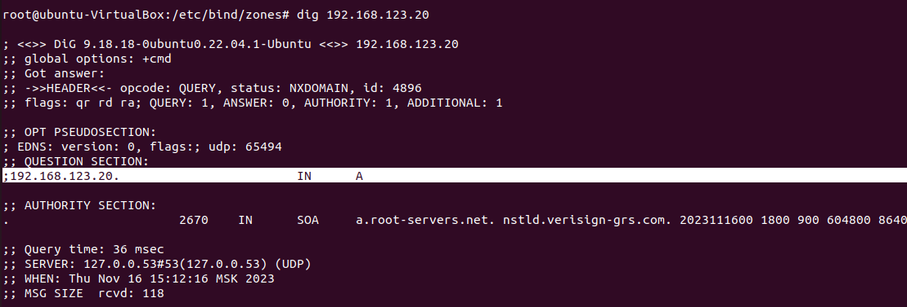
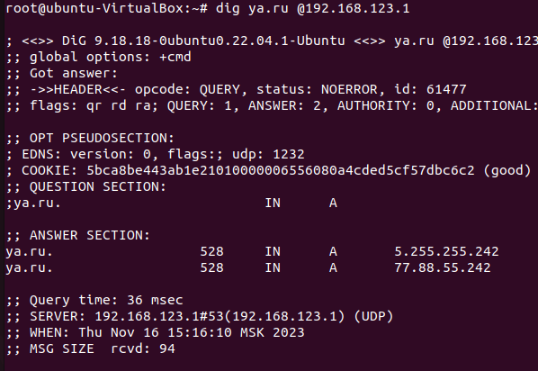

# DNS

### Задание 1.

#### Описание задания
Перед вами стоит задача создать и настроить кэширующий DNS-сервер.

Данные настройки производил по мануалу [dns](https://ru.linux-console.net/?p=3438)

#### Процесс выполнения
1. Запустите программу VirtualBox
2. В программе VirtualBox загрузите операционную систему Linux (дистрибутив на ваш выбор: Deb-дистрибутив или CentOS), если она у вас не установлена в качестве основной системы.
3. Установите DNS-сервер:
    *sudo apt install bind9*
4. Проверьте его работу любым запросом на localhost-адрес. И добавьте в файервол разрешающее правило. 
5. Настройте кэширующий DNS сервер BIND.
6. Сделайте так, чтобы можно было отправить запрос на преобразование адреса netology.local.
7. С помощью утилиты dnstop посмотрите какие входящие и исходящие запросы обрабатывались DNS-сервером.

### Задание 2.

#### Описание задания
Перед вами стоит задача настроить для второй виртуальной машины A-запись и чтобы все обращения по доменному имени проходили через первую виртуальную машину. 

#### Требование к результату
- Вы должны отправить скриншоты с выполненным заданием
- К выполненной задаче добавьте скриншоты с полученными DNS запросами.
- Для выполнения заданий вы можете использовать дистрибутив на ваш выбор (Deb-дистрибутив или CentOS).

#### Процесс выполнения
1. Запустите программу VirtualBox.
2. В программе VirtualBox загрузите вторую виртуальную машину с  операционной системой Linux (дистрибутив на ваш выбор: Deb-дистрибутив или CentOS). 
3. В настройках DNS-сервера укажите сеть второй виртуальной машины, которую будет обслуживать DNS-сервер. И создайте для второй виртуальной машины A-запись. 
4. Выполните перезапуск DNS службы. 
5. Сделайте скриншот результата запроса по доменному имени ко второй виртуальной машине. 
6. Со второй машины выполните обращение к любому ресурсу в Интернете так, чтобы запрос проходил через наш DNS-сервер на первой виртуальной машине. Сделайте скриншот.

