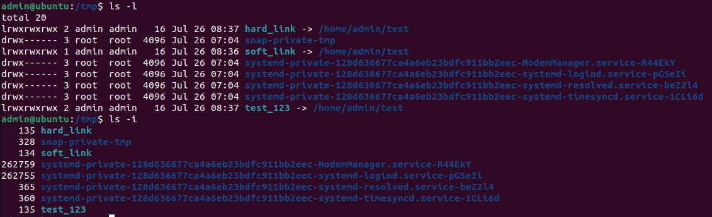
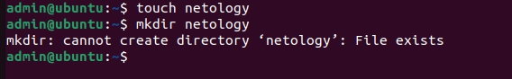
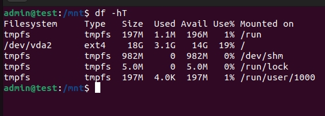
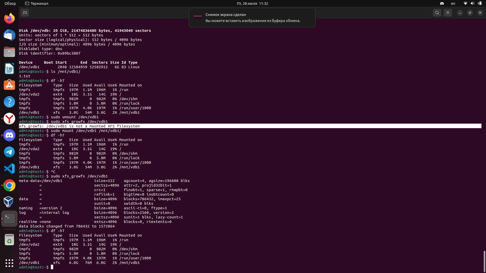

# Файловые системы


### Задача 1

1. Создайте каталог ~/test и в нём файл test_123 с любым содержимым.
2. Создайте символическую ссылку на каталог ~/test по пути /tmp/soft_link.

```bash
ln -s ~/test /tmp/soft_link 
```

3. Используя ссылку /tmp/soft_link, скопируйте файл test_123 в каталог /tmp с тем же именем. Создайте жёсткую ссылку на файл /tmp/test_123 с именем /tmp/hard_link.

```bash
cp -P /tmp/soft_link /tmp/test_123
ln /tmp/test_123 /tmp/hard_link
```

*Вопрос 1. Файл ~/test и /tmp/test_123 — это один и тот же файл (одинаковые inode)?*

Нет, файлы ~/test и /tmp/test_123 не будут считаться одним и тем же файлом (с одинаковыми inode), даже если они содержат одинаковый набор данных.

Символическая ссылка /tmp/soft_link, указывающая на файл ~/test, будет иметь другой inode по сравнению с исходным файлом.


*Вопрос 2. Файл /tmp/soft_link и /tmp/hard_link — это один и тот же файл (одинаковые inode)?*

Да, файлы /tmp/soft_link и /tmp/hard_link будут считаться одним и тем же файлом и имеют одинаковые inode.

Символическая ссылка /tmp/soft_link и жесткая ссылка /tmp/hard_link указывают на один и тот же файл и по сути являются разными именами для одного и того же индексного дескриптора. Информация об этом файле будет храниться в одной и той же записи inode в файловой системе.


*Вопрос 3. Файл /tmp/test_123 и /tmp/hard_link — это один и тот же файл (одинаковые inode)?*

Да, файлы /tmp/test_123 и /tmp/hard_link считаются одним и тем же файлом и имеют одинаковые inode. Жесткая ссылка /tmp/hard_link является альтернативным именем для файла /tmp/test_123 и оба файлы ссылаются на один и тот же индексный дескриптор. Информация об этом файле будет храниться в одной и той же записи inode в файловой системе. Изменения, внесенные в одну ссылку (например, изменение содержимого файла), автоматически отображаются и в другой ссылке.

*Вопрос 4. Докажите, что одна из ссылок символическая, а другая жёсткая. Обязательно приложите к ответу скриншоты команд, которые иллюстрируют различия ссылок разного типа, или, если не уверены, ход решения задания.*



Из скриншота видно, что первая команда 

```bash
ls -l
```

показала все ссылки в директории и к какому файлу они ссылаются, вторая команда показала какие ссылки жесткие с одинаковыми inode

```bash
ls -i
```

### Задача 2

    1. Создайте файл `~/netology`.
    2. Создайте каталог `~/netology/`.
    3. Поместите файл `netology` в каталог `netology`.

    *Какое или какие из трёх действий невозможно выполнить? Почему?*



Из вывода команды mkdir ~/netology, который гласит "cannot create directory ‘/home/admin/netology’: File exists", видно, что директория ~/netology уже существует. Значит и третий пункт не будет выполнен.


### Задача 3

1. Как посмотреть количество `inodes`?
2. В каких файловых системах не может возникнуть проблемы нехватки `inodes`?

*Чтобы посмотреть количество inode в файловой системе, вы можете использовать команду df -i. Она отобразит информацию о файловых системах, включая количество использованных и доступных inode для каждой файловой системы на вашей системе.
Проблемы с нехваткой inode могут возникать в файловых системах, которые были созданы с ограниченным числом inode или в случае, если их использование неоправданно высоко. Некоторые файловые системы, в которых не может возникнуть проблемы нехватки inode, включают:

1. XFS: Файловая система XFS создается с очень большим количеством inode по умолчанию и поддерживает возможность динамического изменения размера inode.

2. Btrfs: Эта файловая система использует древовидную структуру и не имеет ограничений на количество inode.
3. ZFS: Файловая система ZFS также предоставляет гибкое управление inode и может динамически увеличивать их размер при необходимости.

Однако, важно отметить, что доступность пространства inode зависит от конфигурации и параметров, установленных при создании файловой системы, а также от общего объема хранилища, доступного для использования.

### Задача 4

Задание не предполагает использования LVM.

1. Подключите к системе новый диск 3 Гб.
2. Создайте на диске один раздел размером 3 Гб.

```bash
sudo fdisk /dev/vdb
n
1
enter
+3G
```

3. Разметьте раздел как `xfs`.

```bash
sudo mkfs.xfs /dev/vdb1
```

4. Смонтируйте раздел по пути /mnt. Создайте любой файл на смонтированной файловой системе. Сделайте скриншот вывода команды df -hT.

```bash
sudo mkdir /mnt/vdb1
sudo mount /dev/vdb1 /mnt/vdb1
```



5. Увеличьте раздел до 6 Гб.

```bash
sudo fdisk /dev/vdb
d
n
1
enter
+6G
```

6. Расширьте файловую систему на новое свободное пространство.

```bash
sudo xfs_growfs /dev/vdb1
```

7. Убедитесь, что после всех манипуляций созданный вами файл остался внутри раздела и файловой системы.
8. Сделайте скриншот вывода команды df -hT.



