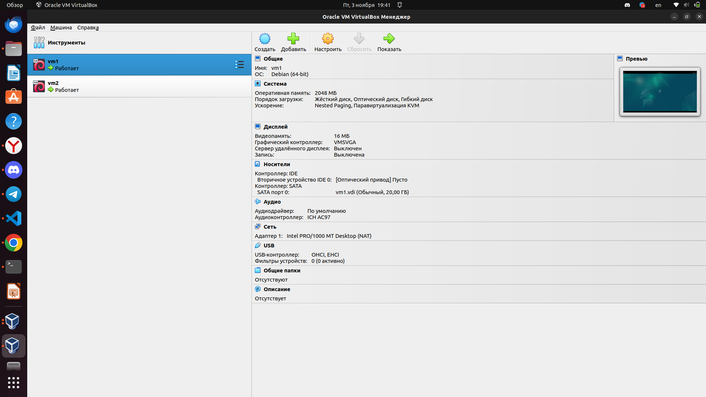
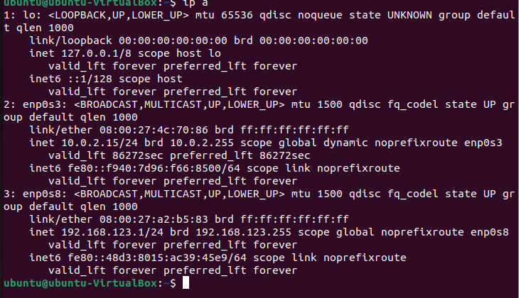
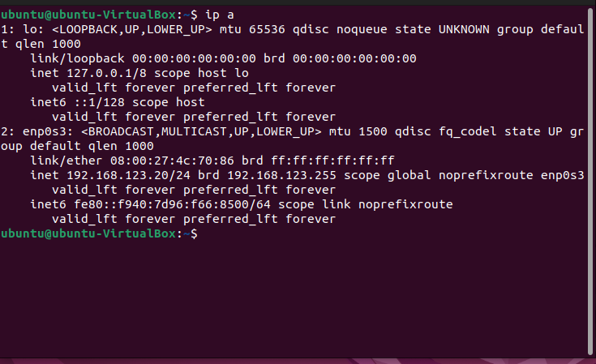
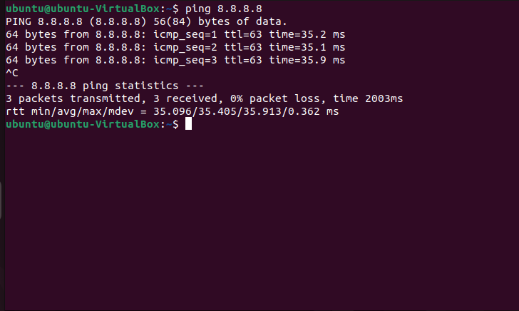
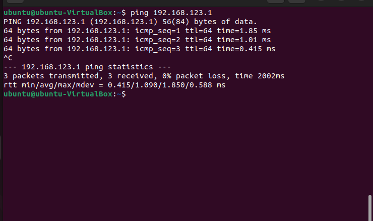
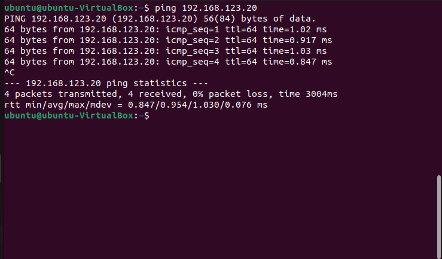
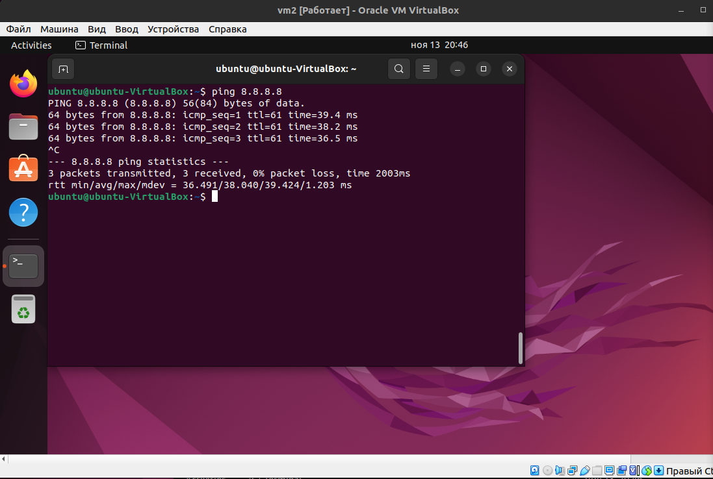
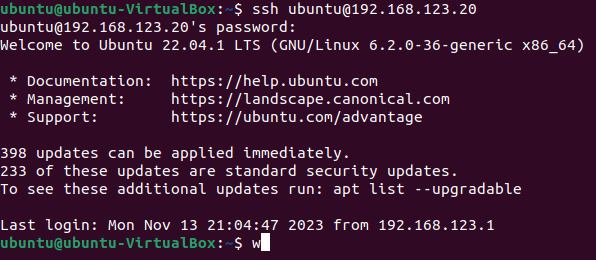

# Сеть и сетевые протоколы: Firewall


## Задание 1. Создание виртуального окружения и настройка сетевых интерфейсов

### Процесс выполнения
1. Запустите программу VirtualBox.
2. В программе VirtualBox создайте две виртуальные машины с Debian, назовите их vm1 и vm2



3. В VirtualBox создайте виртуальную сеть 192.168.123.0/24

не получается создать виртуальную сеть 192.168.123.0/24, вместо нее virtual box создает сеть 192.168.56.0/24, изменить ее не дает, выдает ошибку
4. В VirtualBox настройте сетевые интерфейсы vm1 так, чтобы один интерфейс имел доступ в интернет (bridge или NAT), а второй интерфейс смотрел в виртуальную сеть 192.168.123.0/24



5. В VirtualBox настройте сетевой интерфейс vm2 так, чтобы он смотрел только в виртуальную сеть 192.168.123.0



6. Для vm1: настройте статический IP адрес у интерфейса смотрящего в сеть 192.168.123.0 (адрес в сети 123.0 выберите на своё усмотрение). Настройте IP-адрес интерфейса смотрящего в вашу локальную сеть так, проверьте чтобы была доступность по ICMP c vm1 до 8.8.8.8.



7. Для vm2: настройте статический IP адрес у интерфейса смотрящего в сеть 192.168.123.0 (адрес в сети 123.0 выберите на своё усмотрение), шлюзом укажите IP vm1 из сети 192.168.123.
8. Проверьте доступность по ICMP:
 - vm2 с vm1 по IP

 

 - vm1 с vm2 по IP 



9. Приложите скриншоты результата.зш п
10. Настройте пересылку трафика на vm1, чтобы с vm2 можно было отправить ICMP-запросы на 8.8.8.8 и приложите скриншот результата.


*Разрешаем форвардинг уже установленных соединений*
```bash
ptables -A FORWARD -j ACCEPT -m conntrack --ctstate ESTABLISHED,RELATED -m comment --comment "established traffic"
```
*Включаем маскарадинг всех соединений идущих через enp0s3*
```bash
 iptables -t nat -A POSTROUTING -o enp0s3 -j MASQUERADE -m comment --comment "masquerade"
```




11. Ответ внесите в комментарии к решению задания в личном кабинете Нетологии.

--- 

## Задание 2. Настройка проброса портов

### Описание задания
Перед вами стоит задача настроить проброс портов из локальной сети компьютера в виртуальную сеть.

### Требование к результату
К выполненной задаче добавьте скриншот настроек и успешное подключение через ssh.

### Процесс выполнения
1. Запустите программу VirtualBox.
2. В программе VirtualBox используйте результат предыдущей практической работы.
3. Настройте проброс портов из локальной сети компьютера с VirtualBox через vm1 порт 12322 в виртуальную сеть VirtualBox на 22 порт vm2.

*Пробрасываем трафик с “публичного” IP шлюза порт 12322 на IP адрес 192.168.123.20 порт 22*

```bash
iptables -t nat -A PREROUTING -d 10.0.2.15 -p tcp --dport 12322 -j DNAT --to-destination 192.168.123.20:22

```

*Разрешаем пропускать трафик с enp0s3 через enp0s8 на 192.168.123.10 порт 22*

```bash
iptables -I FORWARD 1 -i enp0s3 -o enp0s8 -d 192.168.123.20 -p tcp -m tcp --dport 22 -j ACCEPT
```


4. Подключитесь к vm2 по ssh через Putty как было показано на уроке. Ответ внесите в комментарии к решению задания в личном кабинете Нетологии


putty у меня нет, подключаюсь через терминал по ssh


---

### Общие критерии оценки
Задание считается выполненным при соблюдении следующих условий:
- Выполнено оба задания.
- К заданиям прикреплены скриншоты настроек виртуальных машин и их доступности после выполнения каждого задания.
- Отображены настройки конфигурации Firewall.
 
 
 
