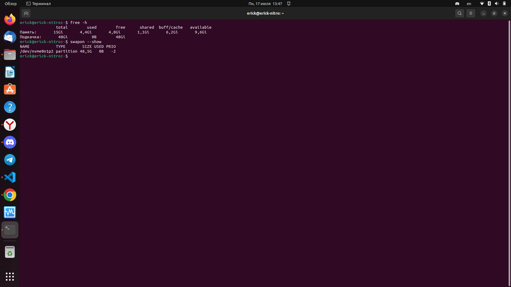

Память, управление памятью

### Задача 1

Что происходит с оперативной памятью во время перехода ПК в:

1. сон (suspend)
2. гибернацию (hibernate)

*Приведите ответ для каждого случая в свободной форме.*

------

Ответ:

1. Отключает часть устройств, или они переходят в режим экономии энергии. Все запущенные приложения остаются в оперативной памяти и находятся в состоянии ожидания. 
2. Все запущенные приложения сохраняются в файл и хранятся на жестком диске. А ПК выключается полностью.

### 

### Задача 2

Определите объём используемой памяти и файла подкачки в вашей системе. Вывод сделайте в человекочитаемом формате.

*Приведите снимок экрана и ответ в свободной форме.*

------

Ответ: 

Из скриншота видно, что файл подкачики состовляет 48 Гбайт

### Задача 3

Определите объем памяти, которая уже не используется процессами, но еще остается в памяти (ключевое слово - inactive).

------

Ответ:

### Задача 4

1. Создайте скрин вывода команды `free -h -t`

2. Создайте swap-файл размером 1Гб
3. Добавьте настройку чтобы swap-файл подключался автоматически при  перезагрузке виртуальной машины (подсказка: необходимо внести изменения в файл `/etc/fstab`)
4. Создайте скрин вывода команды `free -h -t`

5. Создайте скрин вывода команды `swapon -s`

6. Измените процент свободной оперативной памяти, при котором начинает  использоваться раздел подкачки до 30%. Сделайте скрин внесенного  изменения.

------

### Задача 5

Найдите информацию про tmpfs.

*Расскажите в свободной форме, в каких случаях уместно использовать эту технологию.*

Создайте диск `tmpfs` (размер выберите исходя из объёма ОЗУ на ПК: 512Мб-1Гб), смонтируйте его в директорию `/mytmpfs`.

*В качестве ответа приведите скрин вывода команды df- h до и после монтирования диска tmpfs.*

------
