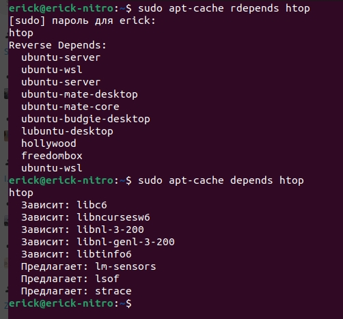
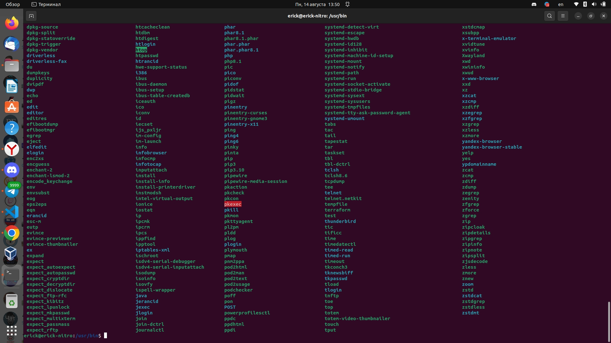
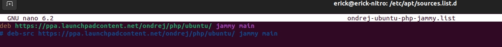
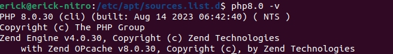
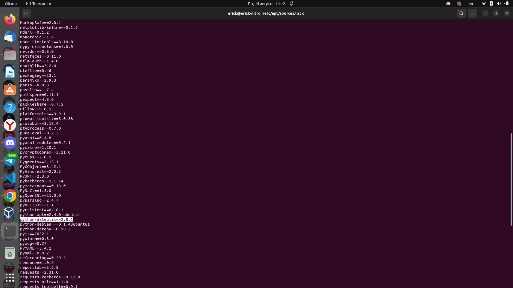
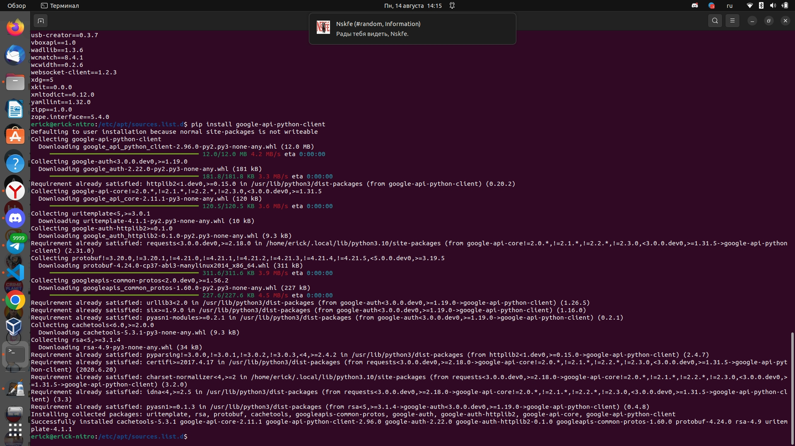

### Управление пакетами

### Задача №1

Опишите достоинства и недостатки работы с пакетным менеджером и репозиторием.

Ответ:

Достоинства работы с пакетным менеджером и репозиторием:

- Удобство установки: Пакетные менеджеры позволяют легко устанавливать и обновлять программное обеспечение. Большинство пакетных менеджеров имеют простой и интуитивно понятный интерфейс, который позволяет быстро найти, установить и обновить нужные пакеты.

- Управление зависимостями: Пакетные менеджеры автоматически управляют зависимостями между пакетами. Они проверяют, какие пакеты уже установлены, и автоматически устанавливают все необходимые зависимости для корректной работы программы.

- Легкость обновления: Пакетные менеджеры обеспечивают простой и удобный способ обновить все установленные пакеты до последней версии. Вам не нужно искать обновления вручную, пакетный менеджер сам проверяет наличие новых версий и предлагает их обновить.

- Безопасность: Пакетные менеджеры обеспечивают безопасность установки программного обеспечения. Они проверяют пакеты на подлинность и цифровую подпись, чтобы убедиться, что они не изменены или заражены вредоносным кодом.

Недостатки работы с пакетным менеджером и репозиторием:

- Ограниченный выбор: Некоторые пакетные менеджеры могут быть ограничены в выборе пакетов. В зависимости от операционной системы, вы можете не найти все программы, которые хотите установить из репозитория. В этом случае вам придется искать другие источники или устанавливать пакеты вручную.

- Зависимость от репозитория: Если репозиторий, из которого вы устанавливаете пакеты, будет недоступен или удален, вам будет трудно получить обновления и новые пакеты. В этом случае вам придется искать альтернативные репозитории или устанавливать пакеты вручную.

- Отсутствие последних версий: В репозиториях могут быть устаревшие версии программных пакетов. Если вы хотите использовать последнюю версию программы с новыми функциями и исправлениями, вам может потребоваться установить ее вручную или с использованием другого источника.

- Возможные конфликты: Если у вас установлены разные пакеты, которые зависят от одной и той же библиотеки или компонента, возможны конфликты. В этом случае вам придется разрешить конфликты вруч


### Задача №2

Ответьте на вопросы:

* какие действия надо выполнить при подключении стороннего репозитория,

- Открыть файл конфигурации пакетного менеджера: Вам нужно открыть файл конфигурации пакетного менеджера, который отвечает за список доступных репозиториев. Каждая операционная система имеет свое собственное расположение файла конфигурации, поэтому вы должны узнать, где он находится.

- Добавить репозиторий в файл конфигурации: Вставьте адрес репозитория в файл конфигурации пакетного менеджера. Обычно это осуществляется путем добавления строки с адресом репозитория в список существующих репозиториев.

- Обновить список пакетов: После добавления репозитория вам нужно обновить список пакетов, чтобы пакетный менеджер мог найти пакеты из этого репозитория. Это можно сделать с помощью команды, которая выглядит примерно так: "sudo apt-get update" для Ubuntu или "sudo yum update" для CentOS.

- Установка программ из стороннего репозитория: Теперь вы можете использовать пакетный менеджер для установки программ из стороннего репозитория. Обычно вам потребуется указать имя пакета при установке, и пакетный менеджер автоматически загрузит и установит его из выбранного репозитория.


* в чём опасность такого способа распространения ПО и как это решить.

1. Безопасность, перед установкой стороннего репозитория следует проверить его на надежность.
2. Совместимость, нужно проверить на совместимость с нашей операционной системой.
3. Низкое качество программ, лучше выбирать популярные и регулярные программы.
4. Отсутствие обновлений, сторонние репозитории могут не обновлять программы, отслеживание активности и регулярности обновлений.


### Задача №3

1. Запустите свою виртуальную машину.
2. Найдите в репозиториях и установите пакет `htop`.

Какие зависимости требует `htop`?

Ответ:
```bash
sudo apt install htop
 ```

следующие зависимости требует пакет htop



следующий путь к усиановленным пакетам в системе /usr/bin/




### Задача №4

1. Подключите репозиторий PHP и установите PHP 8.0.



2. При помощи команды `php -v` убедитесь, что поставлена корректная версия PHP.



### Задача №5

Ваш коллега-программист просит вас установить модуль `google-api-python-client` на сервер, который необходим для программы, работающей с Google API.

Установите этот пакет при помощи менеджера пакетов `pip`.

**Примечение №1:** для установки может понадобиться пакет `python-distutils`, проверьте его наличие в системе.

**Примечение №2:** если возникнет ошибка при установке с помощью Python версии 2, воспользуйтесь командой `python3`.

*Приложите скриншоты  с установленным пакетом `python-distutils`, с версией `Pip` и установленными модулями, они должны быть видимы.*

Смотрим какие пакеты pip python уже установлены

```bash 
pip freeze
```


Здесь мы видим, что пакет `python-distutils` установлен.

Устанавливаем пакет 

```bash
pip install google-api-python-client
```



### Задача №6

1. Перечислите менеджеры пакетов, кроме тех, о которых говорилось на лекции.
В каких дистрибутивах они работают?

2. Есть ли альтернативные менеджеры для тех, которые разбирались на лекции?

*Напишите ответ в свободной форме.*


### Задача №7

1. Скачайте исходники Zabbix и соберите Zabbix Agent для того дистрибутива, на котором вы работаете.
2. Установите его при помощи менеджера пакетов.

*Ответ приведите в виде скриншота.*

### Задача №8

1. Скачайте исходники Zabbix и соберите Zabbix Server для того дистрибутива, на котором вы работаете.
2. Установите его при помощи менеджера пакетов.

