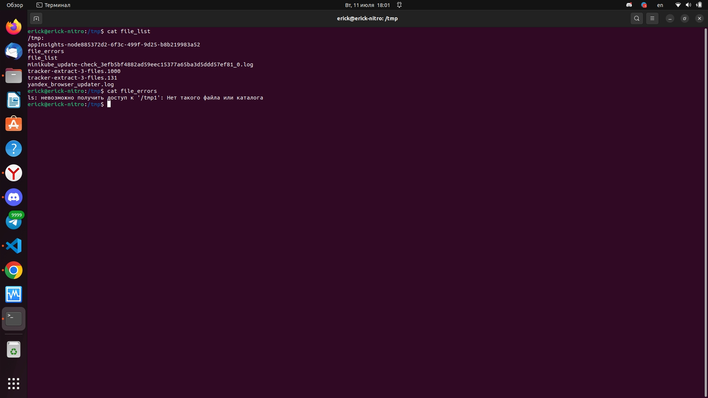

# Процессы, управление процессами 

### Задача №1

Измените команду ```ls /tmp /tmp1```так, чтобы:

1. Результат работы (список файлов) для текущего запуска команды выводился в файл /tmp/file_list.
2. Ошибки для каждого запуска добавлялись в файл /tmp/file_errors.

Примечание к заданию:
1. Создавать /tmp1 не требуется. Директория должна отсутствовать для генерации вывода stderr.
2. Задание необходимо выполнить одной командой.

*В качестве решения пришлите полученную команду и скриншот терминала с выводом содержимого созданных файлов*

------

Ответ:

```bash
ls /tmp /tmp1 1>/tmp/file_list 2>>/tmp/file_errors
```



### Задача №2

Напишите команду, которая выводит все запущенные процессы пользователя root в файл *"user_root_ps"*.

------
Ответ:
```bash
ps -fu root > user_root_ps
```

### Задача №1

Начинающий администратор захотел вывести все запущенные процессы пользователя с логином "2" в файл *"user_2_ps"*.

Для этого он набрал команду:

```
ps -U 2> user_2_ps
```

Затем, он аналогично повторил для пользователя с логином "5" вывод в файл "user_5_ps":

```
ps -U 5> user_5_ps
```

**Вопрос:**

Почему вывод этих команд и содержимое файлов сильно отличаются друг от друга?  Как должны выглядеть правильные команды?

**Примечание:**

Если у вас в системе нет пользователей "2" и/или "5" (это нормальная ситуация), то утилита ps выводит только одну строку:

```
 PID TTY          TIME CMD     
```

Ответ:


```
ps -U 2> user_2_ps
```
Данная команда выводит поток ошибок stderr в файл user_2_ps и записывает ошибки в этот файл,чтобы не было такого, нужно поставить пробел между "2" и ">"

```
ps -U 5> user_5_ps
```
Данная команда выведет ошибку в терминал, чтобы не было такого, нужно поставить пробел между "5" и ">"