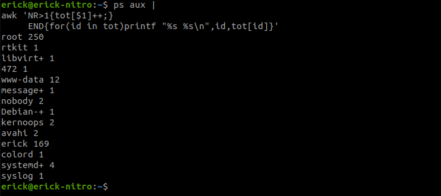

# Regexp и его использование для синтаксического анализа

### Задание 1.

Напишите регулярное выражение для проверки является ли строка `IPv4` адресом.

Для тестов можно использовать файл со следующим содержимым, фильтруя вывод с помощью команды `grep -E`:
```
192.168.0.1
127.0.0.1
84.345.23.11
88.3A.56.76
224.12.76
999.999.999.999
355.255.255.257
0.0.0.0
```

*Пришлите получившееся выражение в качестве ответа.*


Ответ:
```bash
cat ip.txt | grep -E (25[0-5]|2[0-4][0-9]|[01]?[0-9][0-9]?)\.(25[0-5]|2[0-4][0-9]|[01]?[0-9][0-9]?)\.(25[0-5]|2[0-4][0-9]|[01]?[0-9][0-9]?)\.(25[0-5]|2[0-4][0-9]|[01]?[0-9][0-9]?)
```

---

### Задание 2.

В Вашей конфигурации Nginx скопилось много неиспользуемых сегментов и становится сложно его читать.

Используя `sed` удалите все пустые строки и комментарии в конфигурации Nginx.

Попробуйте сделать это одним запуском.

Файл расположен по [ссылке](5-03/nginx.conf)


*Пришлите получившуюся команду в качестве ответа*

Ответ:

```bash
cat nginx.conf | sed '/^ *#/d; /^ *$/d'
```

------

### Задание 3.

Используя `awk` и `ps aux` соберите информацию о:
 - количестве процессов для каждого пользователя;
Ответ:
```bash
ps aux |
awk 'NR>1{tot[$1]++;}
     END{for(id in tot)printf "%s %s\n",id,tot[id]}'
```


 - процессе с самым большим PID;

Ответ:

```bash
ps aux | sort -rnk2 | awk '{print $0}' | head -1
```


 - (дополнительное задание со звездочкой*) суммарном использовании памяти различными пользователями.

*Пришлите скриншоты со скриптами и демонстрацией их работы*

---

## Дополнительные задания (со звездочкой*)
Эти задания дополнительные (не обязательные к выполнению) и никак не повлияют на получение вами зачета по этому домашнему заданию. Вы можете их выполнить, если хотите глубже и/или шире разобраться в материале.

### Задание 4.

Напишите bash-скрипт который собирает информацию о системе и пишет ее в лог каждые 5 секунд.

Используемые параметры:

- loadavg[1,5,15] средний показатель загрузки ЦПУ за последние 1 5 и 15 минут. *Примечание:* хранится в `/proc/loadavg`.
- memfree количество свободной оперативной памяти в байтах. *Примечание:* используем утилиту `free`.
- memtotal количество всей оперативной памяти в байтах. *Примечание:* используем утилиту `free`.
- diskfree свободное место на диске подключенного к /. *Примечание:* используем утилиту `df`.
- disktotal общий объем диска подключенного к /. *Примечание:* используем утилиту `df`.

***Формат записи:*** `timestamp loadavg1 loadavg5 loadavg15 memfree memtotal diskfree disktotal`

Пособирайте данные в течении 5-10 минут.

Анализируя этот лог с помощью `awk` напишите скрипт проверки состояния системы с заданными условиями:

- `loadavg1 < 1` в течении последних 2 минут;
- `memfree / memtotal < 60%` в течении последних 3 минут;
- `diskfree / disktotal < 60%` в течении последних 5 минут.

Скрипт должен возвращать 0 код ответа, если все условия выполняются, и любой другой в случае невыполнения.

В консоль также необходимо выводить, какое именно из условий не выполняется.

*Пришлите получившиеся скрипты в качестве ответа.*

------
