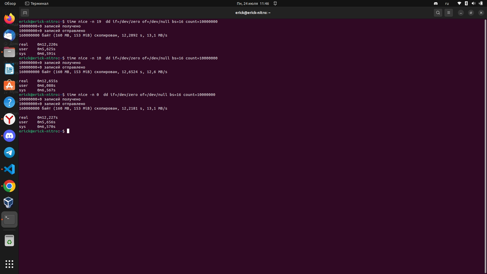
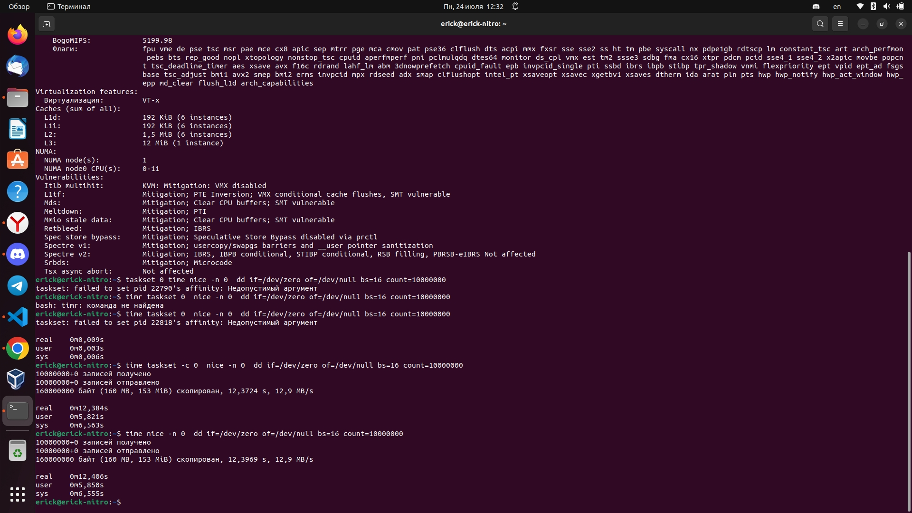

# "Scheduler"

### Задача 1

Многозадачность в современных системах реализована через переключение между процессами с помощью планировщика. Какие операции при этом замедляют работу компьютера?

Ответ:

Задачи, которые зависают, замедляют процесс планировщика, а в следствии замедляют работу компьютера. В действительности планировщики начинают бороться с данными процессами, переходя на другие процесс за счет определения приоритета и многозадачности. Еще может тормозить конкурентность ресурсов, разные проуессы могут запросить один и тот же ресурс, а так же запросы памяти.

---

### Задача 2

В каких случаях используется планировщик SCHED_DEADLINE

Ответ:

Планировщик SCHED_DEADLINE используется в операционных системах Linux для управления ресурсами в реальном времени. Его основное применение - встроенные системы, где требуется гарантированное время отклика и предсказуемая производительность.SCHED_DEADLINE предоставляет возможность установить жесткие временные ограничения на выполнение задач. Он базируется на модели "deadline-based scheduling" и в основном используется в таких областях, как автомобильная промышленность, аэрокосмическая промышленность, промышленная автоматизация и другие критически важные приложения.

---

### Задача 3

Запустите следующий код, имитирующий нагрузку типа ввод / вывод, с значениями `nice` 19, 10, 0 и измерьте время исполнения с помощью утилиты `time`. Объясните получившееся различие во времени исполнения для разных запусков.

    dd if=/dev/zero of=/dev/null bs=16 count=10000000

Ответ:

Из скриншота видно, что данный процесс независимо от приоритета по времени практически одинаково проходит, в связи с тем, что данный процесс не сложен для процессора и настройка его приоритизации практически не повлияет на выполнение процесса.

### Задача 4

Повлияет ли на реальное время исполнения запуск кода из Задания 3 на одном ядре вместо нескольких? Напишите почему да или почему нет. Проверьте своё предположение с помощью утилиты `taskset`

Ответ:

Из скриншота видно, что утилита taskset по средством выделения одного ядра уменьшила время исполнения команды, возможно за счет того, что одно ядро было выделенно под один процесс и больше это ядро не занималось никакими другими процессами незавсимо от приоритетности.
