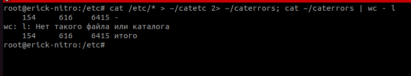

# Работа с текстовыми утилитами

### Задание 1.

- Найдите все файлы с расширением `.conf` в /etc сначала с помощью команды `find`, а потом с помощью команды `locate`;
- Перенаправьте результаты работы каждой команды в разные файлы;
- Подсчитайте количество найденных файлов в каждом случае с помощью `wc`.

```bash
find /etc -type f -name '*.conf' > /home/erick/find.txt; wc -l /home/erick/find.txt

locate '/etc/*.conf' > /home/erick/locale.txt; wc -l /home/erick/locate.txt
```


------
### Задание 2.

 - Выведите с помощью `cat` содержимое всех файлов в директории /etc `cat /etc/*`;
 - Направьте ошибки в отдельный файл в вашей домашней директории;
 - Стандартный поток вывода направьте в другой файл;
 - Подсчитайте, сколько объектов не удалось прочитать.
 

Ответ:

```bash
cat /etc/* > ~/catetc 2> ~/caterrors; cat ~/caterrors | wc - l
```


------
### Задание 3.

 - Перенаправьте результат работы команды `ls -l` в каталоге с большим количеством файлов в утилиту `cut`, чтобы отобразить только права доступа к файлам;
 - Отправьте в конвейере этот вывод на `sort` и `uniq`, чтобы отфильтровать все повторяющиеся строки;
 - Уберите из подсчета строку `total`;
 - С помощью `wc` подсчитайте различные типы разрешений в этом каталоге.
 
Ответ:

```bash
ls -l /dev | cut -f1 -d " " | sort | uniq -c | sed '/total/d' | wc -l
```


------

## Дополнительные задания (со звездочкой*)

Эти задания дополнительные (не обязательные к выполнению) и никак не повлияют на получение вами зачета по этому домашнему заданию. Вы можете их выполнить, если хотите глубже и/или шире разобраться в материале.

### Задание 4.

В ОС Linux скрытыми файлами считаются те, имена которых начинаются с точки.

Сколько скрытых файлов в вашем домашнем каталоге?


------

### Правила приема работы

- Код скриптов оформлен по [правилам оформления кода на Bash](https://github.com/netology-code/snet-homeworks/blob/snet-18/code-style.md)
- Код скриптов размещен в отдельном sh-файле на вашем Google диске
- В личном кабинете отправлена ссылка на  ваш Google документ, в котором прикреплена ссылка на ваш sh-файл с  кодом скриптов и скриншоты, демонстрирующие корректную работу скриптов
- В документе и sh-файле настроены права доступа “Просматривать могут все в Интернете, у кого есть ссылка”
- Название документа содержит название лекции и ваши фамилию и имя

------
### Критерии оценки

Зачет - выполнены все задания, приложен текст команды, приложены соответствующие скриншоты, в выполненных заданиях нет противоречий и нарушения логики

На доработку - задание выполнено частично или не выполнено, в логике выполнения заданий есть противоречия, команды не работают или работают не во всех случаях.
