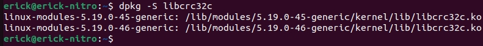
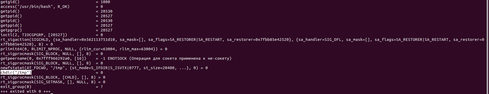

Ядро операционной системы


### Задача №1

При каких событиях выполнение процесса переходит в режим ядра?

Ответ:

1. Вызов системного вызова: Когда пользовательский процесс делает системный вызов, выполнение переходит в режим ядра. Примеры системных вызовов включают чтение/запись файлов, создание процессов, работу с сетью и т. д.

2. Прерывания (Interrupts): Когда процессор получает прерывание от внешнего устройства, чтобы обработать событие, выполнение переходит в режим ядра. Примеры прерываний включают прерывания от таймера системы, прерывания от ввода-вывода, прерывания от клавиатуры, прерывания от сетевых интерфейсов и других устройств.

3. Ошибки и исключения: Если возникает ошибка или исключение, требующие вмешательства ядра, выполнение действий по обработке ошибок переходит в режим ядра. Примеры таких ситуаций включают деление на ноль, обращение к недействительной памяти и другие некорректные операции.

4. Переключение процесса: Когда операционная система принимает решение переключить выполнение процесса на другой процесс, выполнение переходит в режим ядра, чтобы сохранить состояние текущего процесса и загрузить состояние следующего процесса.

5. Загрузка и выгрузка модулей ядра: Если операционная система загружает или выгружает модуль ядра, выполнение процесса может переходить в режим ядра для выполнения соответствующих операций.

### Задача №2

Найдите данные модуля, кто является автором, к какому модулю относится библиотека `libcrc32c`.

Ответ:

Ubuntu-Введите команду dpkg -S <полное имя библиотеки>. Например, если вы ищете информацию о модулю, к которому относится библиотекаlibssl, введите dpkg -S libssl.

Centos-Введите команду rpm -qf <полное имя библиотеки>. Например, если вы ищете информацию о модулю, к которому относится библиотека libssl, введите rpm -qf libssl.



Таким образом видно, что библиотека `libcrc32c` относится к модулю `linux-modules-5.19.0-45-generetic` и к модулю `linux-modules-5.19.0-46-generetic`

так же чтобы узнать, кто является автором данной библиотеки

```bash
modinfo libcrc32c
```
или

```bash
modinfo lobcrc32c | grep auth
```

### Задача №3

Используя утилиту `strace`, выясните, какой системный вызов использует команда `cd`, чтобы сменить директорию.

Примечание

 1. Команда `cd` не является внешним файлом, но для наших целей можно использовать: `strace bash -c 'cd /tmp'`.
 2. При выводе `strace` вы можете увидеть много системных вызовов. Чтобы разобраться, за что отвечает каждый из них, можете воспользоваться встроенной помощью `man`.

Ответ:

Strace - это утилита, которая позволяет отслеживать и анализировать системные вызовы, выполняемые программой. При использовании strace можно увидеть, какие системные вызовы выполняются программой, и анализировать их.

Вот краткое описание некоторых системных вызовов, за которые отвечает strace, включая chdir:

- chdir: Меняет текущую рабочую директорию. Strace отслеживает этот системный вызов, чтобы видеть, как программа изменяет свою текущую директорию.

- open, read, write, close: Strace отслеживает эти системные вызовы, чтобы показать, какие файлы открываются, читаются, записываются и закрываются программой.

- fork, execve, wait, exit: Strace следит за созданием дочерних процессов, выполнением новых программ, ожиданием их завершения и завершением текущего процесса.

- kill: Strace отслеживает, когда процесс отправляет или получает сигналы.

- mmap: Strace позволяет увидеть, какие области памяти отображаются в адресное пространство программы.

- socket, connect, bind, listen, accept: Strace показывает, как программа создает и управляет сокетами для сетевого взаимодействия.

- ioctl: Strace отслеживает использование ioctl для взаимодействия с различными устройствами.

- mprotect, munmap: Strace позволяет видеть, как программа изменяет свойства памяти.

- sigaction: Strace отслеживает настройки обработчиков сигналов программы.

- futex: Strace отслеживает использование futex для синхронизации потоков.

