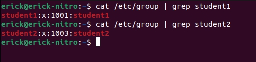
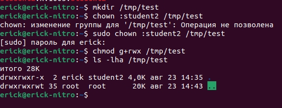
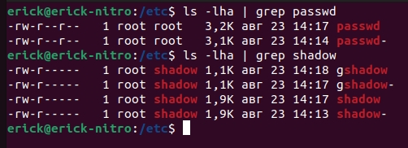
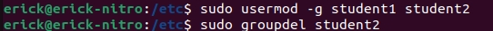
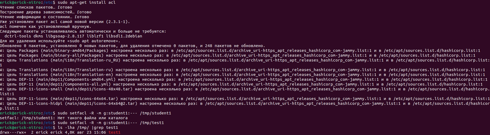

# Управление пользователями

### Задача №1

1. Создайте пользователя `student1` с оболочкой bash, входящего в группу `student1`.

2. Создайте пользователя `student2`, входящего в группу `student2`.

*Приведите своё решение в виде снимков экрана.*

Ответ:

### Задача №2

Создайте в общем каталоге (например, /tmp) директорию и назначьте для неё полный доступ со стороны группы `student2` и доступ на чтение всем остальным.

Ответ: 

### Задача №3

Какой режим доступа установлен для файлов `/etc/passwd` и `/etc/shadow`?

Объясните, зачем понадобилось именно два файла.

Ответ:

Для повышения безопасности пароли пользователей были удалены из файла /etc/passwd и перенесены в файл /etc/shadow. Файл /etc/shadow имеет более жесткие права доступа, и только системные процессы и пользователь root имеют доступ к этому файлу. Таким образом, разделение информации о пользователях на два файла помогает защитить пароли пользователей от несанкционированного доступа.

Файл /etc/passwd по-прежнему содержит другую информацию о пользователях, такую как UID (идентификатор пользователя), группа, домашний каталог и командная оболочка.

### Задача №4

Удалите группу `student2`, а пользователя `student2` добавьте в группу `student1`.

Ответ:

### Задача №5

Напишите своими словами, как происходит сложение и вычитание прав доступа к файлам и папкам.

Ответ:

Сложение и вычитание прав доступа к файлам и папкам основано на использовании битовых операций, таких как "ИЛИ" и "ИСКЛЮЧАЮЩЕЕ ИЛИ" (XOR), для комбинирования прав доступа.

Каждый файл или папка в Linux имеет права доступа, которые определяют, какие действия разрешены для разных пользователей и групп. Права доступа обычно представлены тремя группами: права владельца файла (user), права группы (group) и права для остальных пользователей (others).

Права доступа могут быть представлены с помощью трех основных символов:

- r (read) - разрешение на чтение файла или просмотр содержимого папки.
- w (write) - разрешение на запись в файл или создание/удаление файлов в папке.
- x (execute) - разрешение на выполнение файла в случае файла или разрешение на доступ к содержимому папки и ее подпапкам.

Когда права доступа складываются, учитывается наличие каждого конкретного разрешения. Например, если у файла есть права на чтение (r) и на запись (w), то сумма этих прав будет равна rw.

При вычитании прав доступа, с помощью операции XOR, проверяется наличие или отсутствие каждого конкретного разрешения. Если разрешение присутствует, оно удаляется из прав доступа, а если оно отсутствует, оно остается неизменным. Например, если у файла есть права rwx (чтение, запись, выполнение) и мы вычитаем права x (выполнение), то результатом будет rw (чтение, запись).

Операции сложения и вычитания прав доступа позволяют точно определить, какие разрешения доступа присутствуют или отсутствуют, и настроить права доступа к файлам и папкам в соответствии с требованиями безопасности и ограничениями приложений.

### Задача №6

Создайте в общем каталоге (например, /tmp) директорию и назначьте для неё полный доступ для всех, кроме группы `student1`.  Группа `student1` не должна иметь доступа к содержимому этого каталога.

Ответ:

